# VinhKhanh Explorer — Smart Walking Tour PWA

> **Đồ án môn Ngôn ngữ lập trình C# — Hệ thống hỗ trợ khách du lịch nước ngoài tại khu vực Vĩnh Khánh**

---

## 1. Tổng quan hệ thống (System Overview)

VinhKhanh Explorer là một **Progressive Web App (PWA)** giúp khách du lịch nước ngoài khám phá khu vực Vĩnh Khánh (Quận 4, TP.HCM) thông qua trải nghiệm **Smart Walking Tour**:

| Tính năng | Mô tả |
|---|---|
| **Auto-narration** | Tự động phát thuyết minh khi người dùng đến gần POI |
| **Menu Translation** | Dịch menu/biển hiệu quán ăn sang ngôn ngữ khách |
| **Interactive Map** | Bản đồ tương tác hiển thị POI, vị trí user, navigation |
| **QR Trigger** | Quét QR tại điểm du lịch → phát audio ngay, không cần GPS |
| **CMS/Admin** | Dashboard quản lý POI, audio, translation, analytics |

### Đối tượng sử dụng

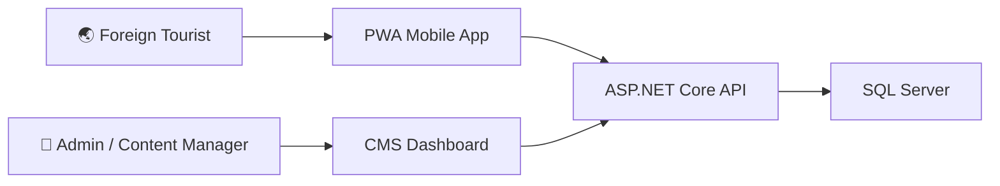

---

## 2. Kiến trúc hệ thống đề xuất (System Architecture)

### 2.1 High-Level Architecture

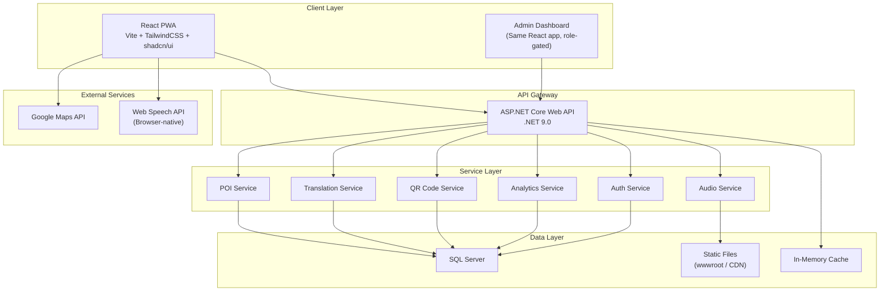

### 2.2 Lựa chọn kiến trúc — Tradeoffs

| Quyết định | Chọn | Lý do | Thay thế |
|---|---|---|---|
| **Frontend framework** | React 19 + Vite 8 | Đã setup sẵn trong repo, ecosystem lớn | Next.js (overkill cho PWA thuần client) |
| **UI Library** | shadcn/ui + Tailwind v4 + Framer Motion | Đã cấu hình `components.json`, style `radix-nova`. Framer Motion cho animations | JolyUI (không cần, shadcn + Framer đủ) |
| **Map SDK** | Google Maps API | Free usage theo SKU ($200 credit/month ≈ 28k map loads miễn phí), phổ biến, tài liệu tiếng Việt tốt | Mapbox (UI đẹp hơn nhưng ít quen thuộc) |
| **TTS Engine** | Web Speech API (browser-native) | Zero cost, offline capable, đa ngôn ngữ | Google Cloud TTS (tốt hơn nhưng tốn phí) |
| **Database** | SQL Server | Có sẵn với Visual Studio, không cần Docker, LocalDB cho dev. Hỗ trợ `geography` type cho spatial queries | PostgreSQL + PostGIS (mạnh hơn nhưng cần setup thêm) |
| **Auth** | JWT + ASP.NET Identity (admin only) | Đơn giản, đủ cho MVP. Tourist không cần login | OAuth (phức tạp hơn mức cần thiết) |
| **Hosting audio** | Static files trong wwwroot | Đơn giản, zero cost | Azure Blob / S3 (mở rộng sau) |

> [!IMPORTANT]
> **Tradeoff lớn nhất**: Dùng **Web Speech API** (browser TTS) thay vì Google Cloud TTS. Chất lượng thấp hơn nhưng **miễn phí hoàn toàn** và **hoạt động offline**. Nếu muốn nâng cấp sau, chỉ cần swap service layer.

---

## 3. Frontend Architecture

### 3.1 Tech Stack (đã có sẵn trong repo)

| Package | Version | Vai trò |
|---|---|---|
| `react` | 19.2.6 | UI framework |
| `vite` | 8.x | Build tool |
| `tailwindcss` | 4.x | Utility-first CSS |
| `shadcn` | 4.8.3 | Component library |
| `radix-ui` | 1.4.3 | Headless UI primitives |
| `lucide-react` | 1.17.0 | Icons |
| `@fontsource-variable/geist` | 5.2.9 | Typography |

### 3.2 Packages cần thêm

| Package | Vai trò |
|---|---|
| `react-router-dom` | Client-side routing |
| `@tanstack/react-query` | Data fetching + caching |
| `@vis.gl/react-google-maps` | Google Maps React wrapper |
| `zustand` | Global state management (lightweight) |
| `qr-scanner` | QR code scanning |
| `vite-plugin-pwa` | PWA + Service Worker |
| `framer-motion` | Premium animations |
| `@radix-ui/react-dialog` | Modal/sheets (qua shadcn) |
| `recharts` | Admin analytics charts |

### 3.3 Directory Structure

```
VinhKhanh-Explorer/src/
├── main.tsx                    # Entry point
├── App.tsx                     # Root component + Router
├── index.css                   # Tailwind + theme tokens
│
├── components/
│   ├── ui/                     # shadcn/ui components
│   ├── map/                    # Map-related components
│   │   ├── MapView.tsx         # Main map container
│   │   ├── POIMarker.tsx       # Custom POI markers
│   │   ├── UserLocation.tsx    # User position indicator
│   │   └── NavigationPanel.tsx # Direction/navigation
│   ├── narration/
│   │   ├── NarrationPlayer.tsx # Audio/TTS player bar
│   │   ├── AudioQueue.tsx      # Queue manager UI
│   │   └── NarrationCard.tsx   # POI narration detail
│   ├── poi/
│   │   ├── POICard.tsx         # POI detail card
│   │   ├── POIList.tsx         # Nearby POI list
│   │   ├── MenuViewer.tsx      # Restaurant menu viewer
│   │   └── POISheet.tsx        # Bottom sheet detail
│   ├── qr/
│   │   └── QRScanner.tsx       # QR scanner overlay
│   ├── admin/
│   │   ├── POIManager.tsx      # CRUD POI
│   │   ├── AudioManager.tsx    # CRUD audio files
│   │   ├── TranslationEditor.tsx
│   │   ├── TourBuilder.tsx     # Tour management
│   │   └── AnalyticsDashboard.tsx
│   └── layout/
│       ├── MobileLayout.tsx    # Mobile shell (nav, header)
│       ├── AdminLayout.tsx     # Admin sidebar layout
│       └── BottomNav.tsx       # Bottom navigation bar
│
├── pages/
│   ├── ExplorePage.tsx         # Map + auto-narration (main)
│   ├── DiscoverPage.tsx        # POI list/browse
│   ├── ScanPage.tsx            # QR scanner
│   ├── SettingsPage.tsx        # Language, audio prefs
│   ├── POIDetailPage.tsx       # Full POI detail
│   └── admin/
│       ├── DashboardPage.tsx
│       ├── POIEditorPage.tsx
│       ├── ToursPage.tsx
│       └── AnalyticsPage.tsx
│
├── hooks/
│   ├── useGeolocation.ts       # Geolocation API wrapper
│   ├── useGeofence.ts          # Geofence detection logic
│   ├── useNarration.ts         # TTS + audio playback
│   ├── useAudioQueue.ts        # Queue management
│   ├── usePOI.ts               # POI data fetching
│   └── useQRScanner.ts         # QR scanning logic
│
├── services/
│   ├── api.ts                  # API client (fetch wrapper)
│   ├── poiService.ts           # POI API calls
│   ├── audioService.ts         # Audio API calls
│   ├── translationService.ts   # Translation API calls
│   └── analyticsService.ts     # Event tracking
│
├── stores/
│   ├── locationStore.ts        # User location state
│   ├── narrationStore.ts       # Audio playback state
│   ├── settingsStore.ts        # User preferences
│   └── authStore.ts            # Admin auth state
│
├── lib/
│   ├── utils.ts                # shadcn utils (exists)
│   ├── geofence.ts             # Geofence engine (pure logic)
│   ├── audioQueue.ts           # Audio queue manager (pure logic)
│   └── constants.ts            # App constants
│
└── types/
    ├── poi.ts                  # POI types
    ├── audio.ts                # Audio/narration types
    ├── translation.ts          # Translation types
    └── api.ts                  # API response types
```

### 3.4 Routing Plan

```typescript
// Tourist Routes (public)
"/"              → ExplorePage      // Map + auto-narration
"/discover"      → DiscoverPage     // Browse POIs
"/poi/:id"       → POIDetailPage    // POI detail + menu
"/scan"          → ScanPage         // QR scanner
"/settings"      → SettingsPage     // Language, audio prefs
"/qr/:poiId"     → Redirect to POIDetailPage + auto-play

// Admin Routes (protected)
"/admin"           → DashboardPage
"/admin/pois"      → POIEditorPage
"/admin/tours"     → ToursPage
"/admin/analytics" → AnalyticsPage
```

---

## 4. Backend Architecture

### 4.1 Chuyển đổi từ MVC sang Web API

Hiện tại project là **ASP.NET Core MVC** (`AddControllersWithViews`). Cần chuyển sang **Web API** để serve REST endpoints cho React frontend.

> [!IMPORTANT]
> Backend sẽ được refactor từ MVC sang **Web API only**. React frontend sẽ được serve riêng (Vite dev server / static build). Backend chỉ phục vụ API endpoints + static audio files.

### 4.2 Project Structure (Backend)

```
DoAn-CSharp/
├── Program.cs                      # Entry point (refactored)
├── appsettings.json                # Config + connection strings
│
├── Controllers/
│   ├── POIController.cs            # CRUD POI endpoints
│   ├── AudioController.cs          # Audio file management
│   ├── TranslationController.cs    # Translation CRUD
│   ├── TourController.cs           # Tour management
│   ├── QRController.cs             # QR code generation/lookup
│   ├── AnalyticsController.cs      # Usage analytics
│   └── AuthController.cs           # Admin authentication
│
├── Models/
│   ├── Entities/
│   │   ├── POI.cs                  # Point of Interest entity
│   │   ├── POITranslation.cs       # Localized content
│   │   ├── AudioFile.cs            # Audio metadata
│   │   ├── MenuItem.cs             # Menu item entity
│   │   ├── MenuItemTranslation.cs  # Menu translation
│   │   ├── Tour.cs                 # Walking tour
│   │   ├── TourStop.cs             # Tour → POI mapping
│   │   ├── QRCode.cs               # QR code entity
│   │   ├── VisitLog.cs             # Analytics event
│   │   └── AdminUser.cs            # Admin account
│   ├── DTOs/
│   │   ├── POIDto.cs               # API response DTOs
│   │   ├── POICreateDto.cs         # Create request
│   │   ├── POIUpdateDto.cs         # Update request
│   │   ├── TranslationDto.cs
│   │   ├── MenuDto.cs
│   │   ├── TourDto.cs
│   │   ├── AnalyticsDto.cs
│   │   └── AuthDto.cs
│   └── ErrorViewModel.cs           # (existing)
│
├── Services/
│   ├── IPOIService.cs + POIService.cs
│   ├── IAudioService.cs + AudioService.cs
│   ├── ITranslationService.cs + TranslationService.cs
│   ├── ITourService.cs + TourService.cs
│   ├── IQRCodeService.cs + QRCodeService.cs
│   ├── IAnalyticsService.cs + AnalyticsService.cs
│   └── IAuthService.cs + AuthService.cs
│
├── Data/
│   ├── AppDbContext.cs             # EF Core DbContext
│   └── Migrations/                 # EF migrations
│
├── Middleware/
│   └── ExceptionMiddleware.cs      # Global error handling
│
├── Extensions/
│   └── ServiceExtensions.cs        # DI registration helpers
│
└── wwwroot/
    └── audio/                      # Static audio files
        ├── en/
        ├── ja/
        ├── ko/
        └── zh/
```

### 4.3 NuGet Packages cần thêm

| Package | Vai trò |
|---|---|
| `Microsoft.EntityFrameworkCore` | ORM |
| `Microsoft.EntityFrameworkCore.SqlServer` | SQL Server provider |
| `Microsoft.EntityFrameworkCore.Tools` | EF CLI tools (migrations) |
| `Microsoft.AspNetCore.Authentication.JwtBearer` | JWT auth |
| `Swashbuckle.AspNetCore` | Swagger/OpenAPI |
| `QRCoder` | QR code generation |
| `AutoMapper` | DTO ↔ Entity mapping |
| `FluentValidation` | Request validation |

### 4.4 Program.cs (Refactored)

```csharp
var builder = WebApplication.CreateBuilder(args);

// === Services ===
builder.Services.AddControllers();
builder.Services.AddEndpointsApiExplorer();
builder.Services.AddSwaggerGen();

// Database (SQL Server)
builder.Services.AddDbContext<AppDbContext>(options =>
    options.UseSqlServer(
        builder.Configuration.GetConnectionString("DefaultConnection")
    ));

// CORS (allow React dev server)
builder.Services.AddCors(options =>
    options.AddPolicy("Frontend", policy =>
        policy.WithOrigins("http://localhost:5173")
              .AllowAnyHeader()
              .AllowAnyMethod()));

// JWT Authentication
builder.Services.AddAuthentication(JwtBearerDefaults.AuthenticationScheme)
    .AddJwtBearer(/* ... */);

// DI - Application Services
builder.Services.AddScoped<IPOIService, POIService>();
builder.Services.AddScoped<IAudioService, AudioService>();
// ... other services

builder.Services.AddAutoMapper(typeof(Program));
builder.Services.AddMemoryCache();

var app = builder.Build();

// === Middleware Pipeline ===
if (app.Environment.IsDevelopment())
{
    app.UseSwagger();
    app.UseSwaggerUI();
}

app.UseHttpsRedirection();
app.UseCors("Frontend");
app.UseStaticFiles(); // Serve audio files from wwwroot
app.UseAuthentication();
app.UseAuthorization();
app.MapControllers();

app.Run();
```

---

## 5. Danh sách Module

### Module Map

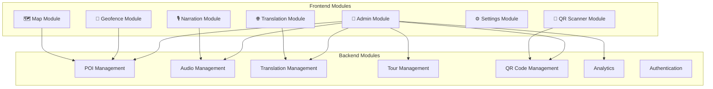

### Module Details

| # | Module | Scope | Priority |
|---|---|---|---|
| 1 | **POI Core** | Entity, CRUD API, data seeding | 🔴 P0 |
| 2 | **Map View** | Map rendering, POI markers, user location | 🔴 P0 |
| 3 | **Geofence Engine** | Location tracking, proximity detection, trigger logic | 🔴 P0 |
| 4 | **Narration Engine** | TTS playback, audio queue, cooldown | 🔴 P0 |
| 5 | **Translation** | Multi-language POI content, menu translation | 🟡 P1 |
| 6 | **QR Scanner** | Camera QR scan, POI lookup, auto-play | 🟡 P1 |
| 7 | **Admin CMS** | POI CRUD UI, audio upload, analytics | 🟡 P1 |
| 8 | **Tour System** | Curated walking tours, ordered stops | 🟢 P2 |
| 9 | **Analytics** | Visit logging, usage stats dashboard | 🟢 P2 |
| 10 | **PWA** | Service worker, offline cache, install prompt | 🟢 P2 |

---

## 6. Database Schema

### 6.1 Entity Relationship Diagram

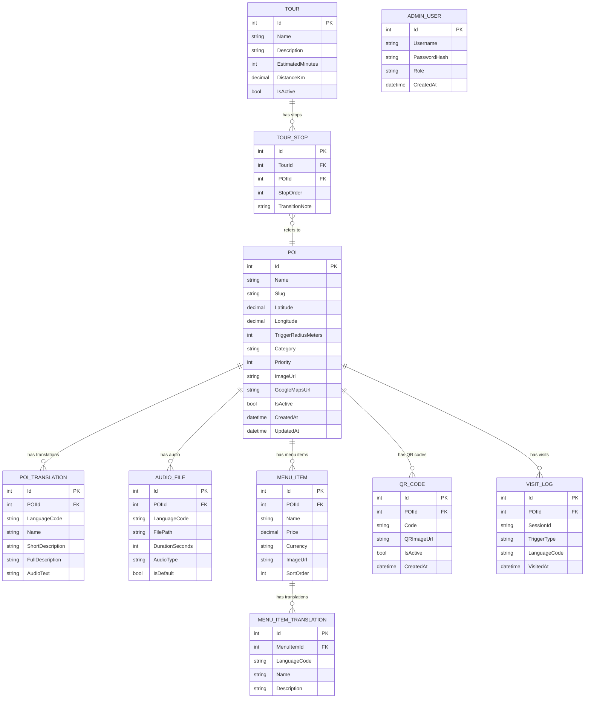

### 6.2 Key Design Decisions

| Decision | Rationale |
|---|---|
| **Separate translation tables** | Dễ thêm ngôn ngữ mới mà không sửa schema chính |
| **AudioText trong POI_TRANSLATION** | Text để TTS đọc, khác với `FullDescription` (có thể dài hơn / format khác) |
| **TriggerRadiusMeters trên POI** | Mỗi POI có radius khác nhau (quán nhỏ = 20m, công viên = 50m) |
| **SessionId trong VISIT_LOG** | Track anonymous sessions (no login), dùng UUID từ browser |
| **Category enum** | `restaurant`, `cafe`, `temple`, `market`, `park`, `landmark`, `street_art` |

### 6.3 Supported Languages (MVP)

| Code | Language | Priority |
|---|---|---|
| `en` | English | 🔴 Required |
| `ja` | Japanese | 🟡 Nice-to-have |
| `ko` | Korean | 🟡 Nice-to-have |
| `zh` | Chinese (Simplified) | 🟡 Nice-to-have |

---

## 7. API Design

### 7.1 RESTful Endpoints

#### POI Endpoints (Public)

```
GET    /api/pois                    # List all active POIs
GET    /api/pois?lat=X&lng=Y&r=500  # POIs within radius (meters)
GET    /api/pois/{id}               # POI detail + translations
GET    /api/pois/{id}/menu          # POI menu items
GET    /api/pois/{id}/audio/{lang}  # Get audio file URL
GET    /api/pois/nearby?lat=X&lng=Y # Nearest POIs (sorted by distance)
```

#### QR Endpoints (Public)

```
GET    /api/qr/{code}               # Lookup POI by QR code
```

#### Translation Endpoints (Public)

```
GET    /api/translations/{poiId}/{lang}  # Get POI translation
```

#### Tour Endpoints (Public)

```
GET    /api/tours                   # List active tours
GET    /api/tours/{id}              # Tour detail + stops
```

#### Analytics Endpoints (Public — fire-and-forget)

```
POST   /api/analytics/visit         # Log a POI visit event
```

#### Admin Endpoints (Protected — JWT)

```
POST   /api/auth/login              # Admin login → JWT

# POI Management
POST   /api/admin/pois              # Create POI
PUT    /api/admin/pois/{id}         # Update POI
DELETE /api/admin/pois/{id}         # Delete POI

# Audio Management
POST   /api/admin/audio/upload      # Upload audio file
DELETE /api/admin/audio/{id}        # Delete audio

# Translation Management
POST   /api/admin/translations      # Create/update translation
DELETE /api/admin/translations/{id} # Delete translation

# QR Management
POST   /api/admin/qr/generate/{poiId}  # Generate QR for POI

# Analytics
GET    /api/admin/analytics/summary     # Dashboard stats
GET    /api/admin/analytics/visits      # Visit logs
```

### 7.2 Sample API Response

```json
// GET /api/pois/1?lang=en
{
  "id": 1,
  "name": "Cơm Tấm Bà Lan",
  "slug": "com-tam-ba-lan",
  "latitude": 10.7575,
  "longitude": 106.7020,
  "triggerRadiusMeters": 25,
  "category": "restaurant",
  "priority": 8,
  "imageUrl": "/images/pois/com-tam-ba-lan.jpg",
  "googleMapsUrl": "https://maps.google.com/?q=...",
  "translation": {
    "name": "Broken Rice Bà Lan",
    "shortDescription": "Famous broken rice stall since 1995",
    "fullDescription": "One of the most iconic broken rice...",
    "audioText": "Welcome to Broken Rice Bà Lan, one of the most..."
  },
  "audioUrl": "/audio/en/com-tam-ba-lan.mp3",
  "hasPreRecordedAudio": true,
  "menuItemCount": 12,
  "qrCode": "VKE-POI-001"
}
```

---

## 8. Geofence Engine Design

### 8.1 Architecture

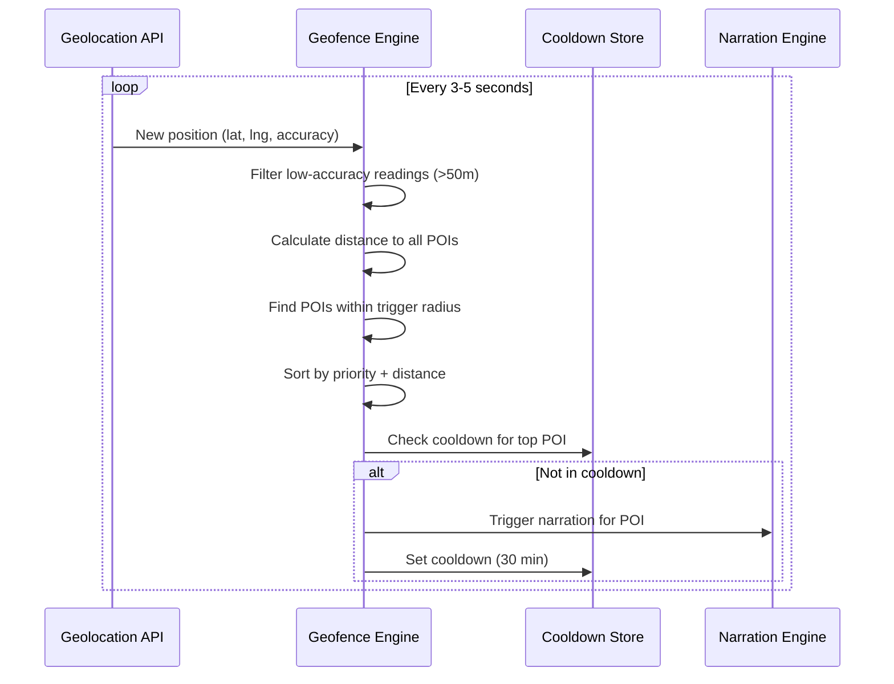

### 8.2 Core Logic (Frontend — `lib/geofence.ts`)

```typescript
interface GeofenceConfig {
  updateIntervalMs: 3000;       // GPS poll interval
  minAccuracyMeters: 50;        // Ignore inaccurate readings
  cooldownMinutes: 30;          // Don't re-trigger same POI
  debounceMs: 2000;             // Debounce trigger events
  maxSimultaneousTriggers: 1;   // Only trigger 1 POI at a time
}

interface GeofenceEvent {
  poi: POI;
  distance: number;             // meters from user
  triggerType: 'enter' | 'proximity';
}
```

**Thuật toán chính:**

1. **Filter**: Loại bỏ readings có `accuracy > 50m`
2. **Distance Calc**: Haversine formula cho mỗi POI
3. **Range Check**: `distance <= poi.triggerRadiusMeters`
4. **Priority Sort**: Sort theo `priority DESC`, `distance ASC`
5. **Cooldown Check**: Skip nếu đã trigger trong 30 phút qua
6. **Debounce**: Chỉ trigger nếu user ở trong vùng >= 2 giây liên tiếp
7. **Emit**: Gửi `GeofenceEvent` đến Narration Engine

### 8.3 Haversine Distance Formula

```typescript
function haversineDistance(
  lat1: number, lng1: number,
  lat2: number, lng2: number
): number {
  const R = 6371000; // Earth radius in meters
  const φ1 = (lat1 * Math.PI) / 180;
  const φ2 = (lat2 * Math.PI) / 180;
  const Δφ = ((lat2 - lat1) * Math.PI) / 180;
  const Δλ = ((lng2 - lng1) * Math.PI) / 180;

  const a = Math.sin(Δφ / 2) ** 2
          + Math.cos(φ1) * Math.cos(φ2) * Math.sin(Δλ / 2) ** 2;
  const c = 2 * Math.atan2(Math.sqrt(a), Math.sqrt(1 - a));

  return R * c; // meters
}
```

> [!TIP]
> Với ~50 POI trong khu vực Vĩnh Khánh, brute-force distance check mỗi 3s là đủ nhanh. Không cần spatial index phía client. Phía server, dùng SQL Server `geography` type hoặc Haversine formula trong LINQ cho API `/pois/nearby`.

---

## 9. Narration / Audio Queue Design

### 9.1 Architecture

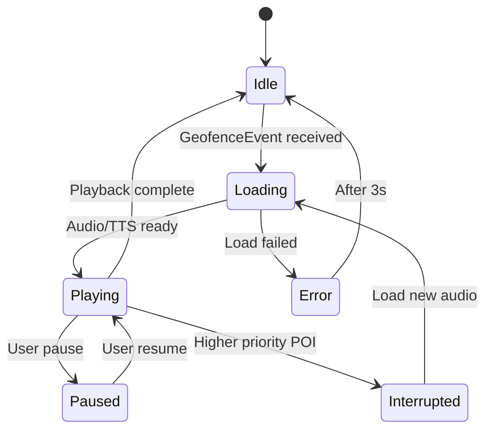

### 9.2 Audio Source Priority

```
1. Pre-recorded audio file (highest quality)
2. TTS from audioText field
3. TTS from shortDescription (fallback)
```

### 9.3 Queue Manager Logic

```typescript
interface NarrationItem {
  poiId: number;
  source: 'audio' | 'tts';
  audioUrl?: string;
  text?: string;
  language: string;
  priority: number;
}

interface QueueConfig {
  maxQueueSize: 3;
  interruptOnHigherPriority: true;
  fadeOutDurationMs: 500;
  gapBetweenItemsMs: 1000;
}
```

**Rules:**
- Queue tối đa 3 items
- POI có `priority` cao hơn sẽ interrupt item đang phát
- Fade out 500ms trước khi chuyển
- Gap 1s giữa các items
- Không enqueue POI đã trong cooldown
- User có thể pause/resume/skip

### 9.4 Web Speech API Integration

```typescript
function speakText(text: string, lang: string): Promise<void> {
  return new Promise((resolve, reject) => {
    const utterance = new SpeechSynthesisUtterance(text);
    utterance.lang = lang; // e.g., 'en-US', 'ja-JP'
    utterance.rate = 0.9;  // Slightly slower for tourists
    utterance.onend = () => resolve();
    utterance.onerror = (e) => reject(e);
    speechSynthesis.speak(utterance);
  });
}
```

---

## 10. Workflow hoạt động

### 10.1 Tourist Flow — Auto-Narration

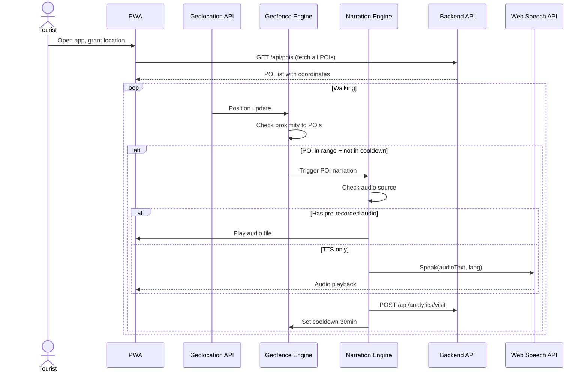

### 10.2 Tourist Flow — QR Scan

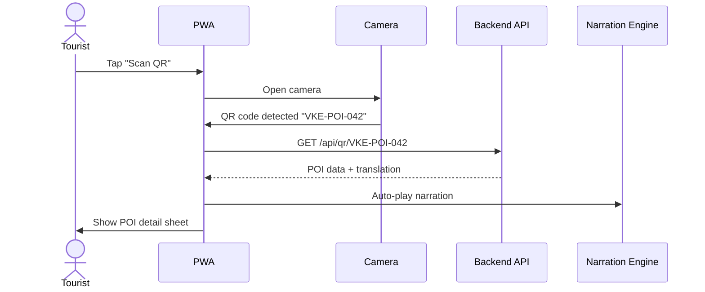

### 10.3 Admin Flow — Content Management

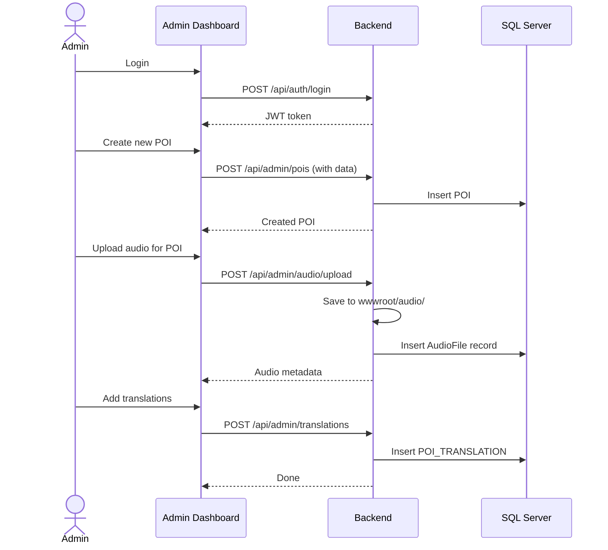

---

## 11. UI/UX Structure

### 11.1 Screen Map

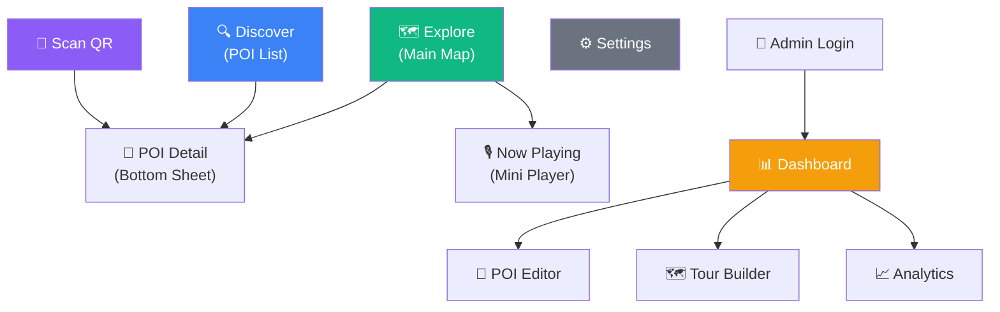

### 11.2 Mobile Layout

```
┌─────────────────────────────────┐
│ ≡  VinhKhanh Explorer     🌐 EN │  ← Header (language selector)
├─────────────────────────────────┤
│                                 │
│         [MAP VIEW]              │  ← Full-screen map
│                                 │
│    📍 You are here              │
│    ⭐ Cơm Tấm Bà Lan (25m)     │  ← Nearest POI indicator
│                                 │
├─────────────────────────────────┤
│ ┌─────────────────────────────┐ │
│ │ 🎙️ Now Playing              │ │  ← Mini narration player
│ │ Broken Rice Bà Lan     ▶ ⏭ │ │
│ │ ████████░░░░  1:23 / 2:45  │ │
│ └─────────────────────────────┘ │
├─────────────────────────────────┤
│  🗺️ Explore  🔍 Discover  📸 Scan  ⚙️ │  ← Bottom navigation
└─────────────────────────────────┘
```

### 11.3 Design System

| Element | Specification |
|---|---|
| **Font** | Geist Variable (đã cài) |
| **Colors** | Dark-mode first. Accent: Emerald (`#10b981`) cho travel vibe |
| **Radius** | `0.625rem` base (đã cấu hình) |
| **Icons** | Lucide React (đã cài) |
| **Animations** | Framer Motion — sheet slide-up, marker pulse, player transitions |
| **Glass effect** | `backdrop-blur-xl bg-white/10` cho overlays trên map |
| **Map style** | Google Maps Dark/Light theme (custom JSON style) tùy theo dark mode |
| **Shadows** | Minimal, chỉ dùng cho elevated cards |

### 11.4 Key UI Components

| Component | Style |
|---|---|
| **POI Bottom Sheet** | Slide-up sheet (70% screen), glassmorphism header, cover image |
| **Narration Player** | Fixed bottom bar, progress indicator, waveform animation |
| **POI Markers** | Category-colored pins, pulse animation khi active |
| **QR Scanner** | Full-screen camera overlay, scan frame animation |
| **Menu Viewer** | Card grid, bilingual text (Vietnamese + selected language) |
| **Admin Dashboard** | Sidebar layout, data tables, chart widgets |

---

## 12. PWA Strategy

### 12.1 Configuration (`vite-plugin-pwa`)

```typescript
// vite.config.ts additions
import { VitePWA } from 'vite-plugin-pwa';

export default defineConfig({
  plugins: [
    // ...existing
    VitePWA({
      registerType: 'autoUpdate',
      manifest: {
        name: 'VinhKhanh Explorer',
        short_name: 'VKExplorer',
        description: 'Smart walking tour for Vinh Khanh district',
        theme_color: '#10b981',
        background_color: '#0a0a0a',
        display: 'standalone',
        orientation: 'portrait',
        start_url: '/',
        icons: [
          { src: '/icon-192.png', sizes: '192x192', type: 'image/png' },
          { src: '/icon-512.png', sizes: '512x512', type: 'image/png' },
        ],
      },
      workbox: {
        runtimeCaching: [
          {
            urlPattern: /\/api\/pois/,
            handler: 'StaleWhileRevalidate',
            options: { cacheName: 'poi-cache', expiration: { maxAgeSeconds: 3600 } }
          },
          {
            urlPattern: /\/audio\//,
            handler: 'CacheFirst',
            options: { cacheName: 'audio-cache', expiration: { maxEntries: 50 } }
          },
        ],
      },
    }),
  ],
});
```

### 12.2 Offline Strategy

| Resource | Strategy | Rationale |
|---|---|---|
| **App shell (HTML/CSS/JS)** | Precache | Luôn available offline |
| **POI data** | Stale-While-Revalidate | Hiển thị cached data, update background |
| **Audio files** | Cache-First | Không thay đổi thường xuyên, tiết kiệm bandwidth |
| **Map tiles** | Network-First | Google Maps cache tiles tự động, fallback hiển thị POI list |
| **Images** | Cache-First, max 100 | Cache ảnh POI đã xem |

---

## 13. Security Considerations

| Concern | Mitigation |
|---|---|
| **Admin auth** | JWT Bearer tokens, short expiry (1h), refresh token rotation |
| **API rate limiting** | `AspNetCoreRateLimit` middleware — 100 req/min per IP |
| **CORS** | Whitelist only frontend origin |
| **File upload** | Validate file type (audio only: mp3, wav, ogg), max 10MB |
| **SQL Injection** | EF Core parameterized queries (built-in) |
| **XSS** | React auto-escapes, CSP headers |
| **Location data** | Never store raw user GPS on server. Only log POI visit events |
| **Audio files** | Public access (no auth needed for tourist experience) |
| **QR codes** | UUID-based codes, not sequential — prevent guessing |
| **HTTPS** | Enforce HTTPS (required for Geolocation API) |

> [!CAUTION]
> **Geolocation API requires HTTPS**. Phải có HTTPS certificate ngay cả khi dev local. Dùng `dotnet dev-certs https --trust` và Vite HTTPS plugin.

---

## 14. Công nghệ đề xuất (Final Stack)

### Frontend

| Tech | Version | Purpose |
|---|---|---|
| React | 19.x | UI framework |
| Vite | 8.x | Build & dev server |
| TypeScript | 6.x | Type safety |
| Tailwind CSS | 4.x | Styling |
| shadcn/ui | 4.x | Component library |
| Google Maps API | latest | Interactive map |
| Zustand | 5.x | State management |
| TanStack Query | 5.x | Server state |
| Framer Motion | 11.x | Animations |
| vite-plugin-pwa | 0.x | PWA support |

### Backend

| Tech | Version | Purpose |
|---|---|---|
| ASP.NET Core | 9.0 | Web API framework |
| Entity Framework Core | 9.x | ORM |
| SQL Server | 2022 / LocalDB | Database |
| JWT | - | Admin authentication |
| Swagger | - | API documentation |
| QRCoder | - | QR generation |

### DevOps / Tooling

| Tech | Purpose |
|---|---|
| SQL Server Management Studio (SSMS) | Database management |
| SQL Server LocalDB | Local dev database (ships with VS) |
| Postman / Swagger UI | API testing |
| GitHub Actions | CI/CD (optional) |

---

## 15. Timeline phát triển theo tuần

### Tổng thời gian: **8 tuần** (Deadline: ~30/07/2026)

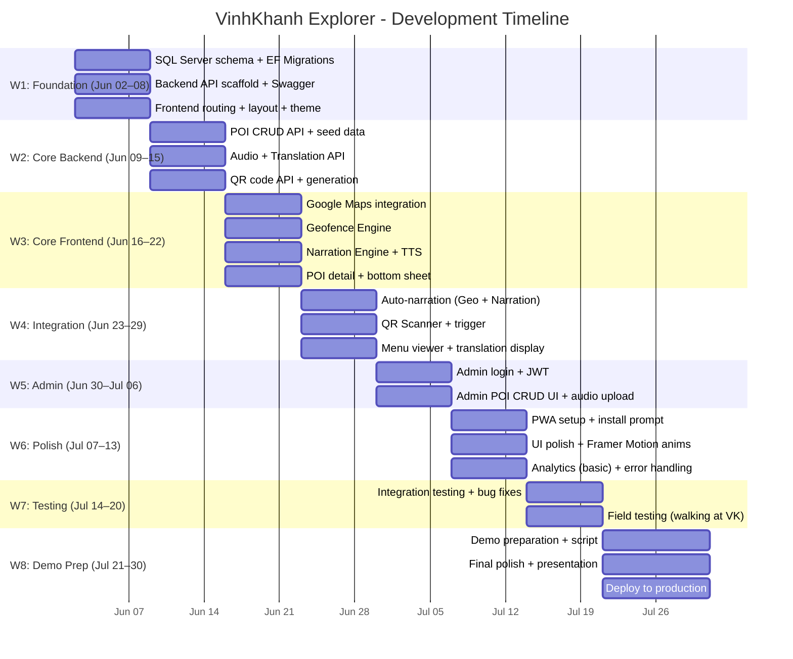

### Week-by-Week Summary + Team Allocation (2 người)

> **Member A** = Chủ yếu **Backend** (C# API, DB, Auth)
> **Member B** = Chủ yếu **Frontend** (React, Map, UI)
> Cả hai cùng làm integration + testing.

| Tuần | Ngày | Member A (Backend) | Member B (Frontend) |
|---|---|---|---|
| **1** | Jun 02–08 | SQL Server schema, EF migrations, API scaffold + Swagger | Frontend routing, layout shell, theme setup, install shadcn components |
| **2** | Jun 09–15 | POI CRUD API, Translation API, QR API, seed data 15 POIs | Google Maps integration, POI markers, user location display |
| **3** | Jun 16–22 | Analytics API, file serving, API error handling | Geofence engine, narration engine (TTS), audio queue |
| **4** | Jun 23–29 | JWT auth, Admin API endpoints | POI bottom sheet, menu viewer, QR scanner UI |
| **5** | Jun 30–Jul 06 | Admin CRUD refinement, QR code generation | Admin dashboard UI, POI editor form, translation editor |
| **6** | Jul 07–13 | Deploy backend (Azure), API rate limiting, CORS | PWA setup, Framer Motion animations, UI polish |
| **7** | Jul 14–20 | Backend tests, bug fixes, performance | Frontend tests, bug fixes, field testing ở Vĩnh Khánh |
| **8** | Jul 21–30 | Deploy production, final API fixes | Demo script, presentation, final UI polish |

---

## 16. Khó khăn kỹ thuật và cách xử lý

| # | Vấn đề | Mức độ | Giải pháp |
|---|---|---|---|
| 1 | **GPS accuracy trong hẻm/indoor** | 🔴 Cao | QR fallback, tăng trigger radius cho indoor POI, filter low-accuracy readings |
| 2 | **TTS quality khác nhau trên browsers** | 🟡 Trung bình | Dùng TTS hoàn toàn (không thu audio). Chọn voice tốt nhất từ `getVoices()`, test kỹ trên Chrome/Safari mobile. Rate 0.9x cho dễ nghe |
| 3 | **Battery drain từ GPS tracking** | 🟡 Trung bình | Giảm poll interval khi user đứng yên, dùng `watchPosition` thay `getCurrentPosition` liên tục |
| 4 | **Map offline** | 🟡 Trung bình | Google Maps cache tiles tự động. Fallback: hiển thị POI list khi mất mạng |
| 5 | **Đa ngôn ngữ TTS voices** | 🟢 Thấp | Web Speech API hỗ trợ nhiều ngôn ngữ. Kiểm tra `speechSynthesis.getVoices()` để list available voices |
| 6 | **Audio conflicts** | 🟡 Trung bình | Queue manager với priority-based interruption, fade transitions |
| 7 | **Camera permission cho QR** | 🟢 Thấp | Graceful fallback: hiện input field để nhập QR code thủ công |
| 8 | **Google Maps API billing** | 🟢 Thấp | Free $200 credit/month (~28k map loads). Restrict API key by HTTP referrer. Monitor usage trong Google Cloud Console |

> [!WARNING]
> **GPS accuracy** là rủi ro lớn nhất. Khu vực Vĩnh Khánh có nhiều hẻm nhỏ, GPS có thể sai 20-50m. **Phải có QR Code fallback** và trigger radius đủ lớn (25-50m).

---

## 17. Phạm vi MVP phù hợp cho sinh viên

### ✅ MVP Scope (Must Have)

| Feature | Detail |
|---|---|
| **10-15 POIs** | Seed data thực tế từ khu Vĩnh Khánh |
| **Map view** | Hiển thị POIs + user location |
| **Auto-narration** | Geofence trigger + TTS playback |
| **2 languages** | Vietnamese + English |
| **QR scan** | Scan → POI detail → auto-play |
| **POI detail** | Name, description, image, menu (cho quán ăn) |
| **Admin CRUD** | Basic POI create/edit/delete |
| **Responsive** | Mobile-first, usable on desktop |

### ❌ Cut from MVP (Nice-to-Have)

| Feature | Reason to defer |
|---|---|
| Tour builder | Phức tạp, không cần cho demo cơ bản |
| Analytics dashboard | Có thể demo bằng database queries |
| Offline mode (full) | PWA install prompt đủ ấn tượng |
| AI translation | Manual translation đủ cho 15 POI |
| Social features | Ngoài scope |
| User accounts | Tourist không cần login |

### 📊 Estimated LOC

| Component | Estimated |
|---|---|
| Backend (C#) | ~2,500–3,500 lines |
| Frontend (TSX) | ~4,000–5,500 lines |
| Styles (CSS) | ~500–800 lines |
| Tests | ~500–800 lines |
| **Total** | **~7,500–10,500 lines** |

---

## 18. Ý tưởng mở rộng tương lai

| # | Feature | Complexity | Impact |
|---|---|---|---|
| 1 | **AI-powered translation** | Medium | Dùng GPT API để dịch real-time menu chụp từ camera |
| 2 | **AR overlay** | High | WebXR để hiển thị POI info overlay trên camera |
| 3 | **User reviews/ratings** | Low | Cho phép tourist đánh giá POI |
| 4 | **Custom tours** | Medium | User tạo tour riêng, share link |
| 5 | **Multi-area expansion** | Low | Thêm khu vực khác (Bùi Viện, Thảo Điền, etc.) |
| 6 | **Pre-recorded pro audio** | Low | Thuê voice actor thu audio chuyên nghiệp |
| 7 | **Push notifications** | Medium | Notify deals/events tại POI gần |
| 8 | **Google Cloud TTS** | Low | Upgrade từ browser TTS sang cloud TTS chất lượng cao |
| 9 | **Chatbot assistant** | Medium | AI chatbot hỏi đáp về khu vực |
| 10 | **Revenue model** | Medium | Premium tours, sponsored POI placement |

---

## 19. Demo Strategy để gây ấn tượng hội đồng

### 19.1 Demo Flow (10-15 phút)

```
1. [2 phút] Giới thiệu vấn đề + đối tượng sử dụng
   → Video/ảnh khách du lịch ở Vĩnh Khánh, language barrier

2. [1 phút] Mở app trên điện thoại (PWA)
   → Cài từ browser, full-screen, trông như native app

3. [3 phút] Demo Map + Auto-narration
   → Simulate GPS movement (dev tools) hoặc quay video thực tế
   → Audio tự phát khi "đến gần" POI
   → Chuyển ngôn ngữ (EN → JA → KO)

4. [2 phút] Demo QR Scan
   → In QR code, scan bằng camera
   → POI detail hiện lên + audio tự phát

5. [2 phút] Demo Menu Translation
   → Mở menu quán ăn → hiển thị song ngữ
   → TTS đọc tên món

6. [2 phút] Demo Admin CMS
   → Login admin → tạo POI mới → hiển thị trên map ngay

7. [1 phút] Kỹ thuật highlights
   → Architecture diagram
   → Tech stack
   → PWA capabilities (offline, installable)
```

### 19.2 Demo Tips

> [!TIP]
> **GPS Simulation**: Dùng Chrome DevTools > Sensors > Geolocation để simulate walking path. Chuẩn bị sẵn preset coordinates cho demo.

> [!TIP]
> **Backup Plan**: Quay sẵn video demo ngoài thực tế (field test) phòng trường hợp GPS/network không ổn định trong phòng demo.

> [!TIP]
> **Wow Factor**: Chuẩn bị 3-5 QR code in sẵn, đặt trên bàn. Mời hội đồng scan trực tiếp bằng điện thoại cá nhân.

### 19.3 Seed Data đề xuất (15 POI)

| # | Name | Category | Why |
|---|---|---|---|
| 1 | Cơm Tấm Bà Lan | restaurant | Iconic broken rice |
| 2 | Hủ Tiếu Sa Đéc | restaurant | Famous noodle soup |
| 3 | Bánh Mì Vĩnh Khánh | restaurant | Street food |
| 4 | Ốc Đào | restaurant | Snail restaurant |
| 5 | Café Vĩnh Khánh | cafe | Local coffee shop |
| 6 | Chùa Vĩnh Khánh | temple | Buddhist temple |
| 7 | Chợ Vĩnh Khánh | market | Local market |
| 8 | Công Viên Kênh Tẻ | park | Waterfront park |
| 9 | Hẻm Ẩm Thực | street_food | Food alley |
| 10 | Street Art Wall | street_art | Urban art |
| 11 | Bún Bò Huế Cô Ba | restaurant | Hue beef noodle |
| 12 | Quán Nước Mía | cafe | Sugarcane juice |
| 13 | Cầu Kênh Tẻ | landmark | Bridge landmark |
| 14 | Xe Buýt Station | landmark | Bus stop (QR focus) |
| 15 | Tiệm Tạp Hóa Cổ | landmark | Heritage shop |

---

## 20. Đề xuất cách deploy production/demo

### 20.1 Demo Environment (Chi phí thấp)

| Component | Platform | Cost |
|---|---|---|
| **Frontend** | Vercel / Netlify | Free |
| **Backend** | Azure App Service (Free tier) / Railway | Free tier |
| **Database** | Azure SQL Database (Free tier, 32GB) | Free |
| **Google Maps** | Google Cloud ($200 credit/month) | Free |
| **Domain** | Miễn phí (*.vercel.app) hoặc mua .com (~$12/year) |

> [!TIP]
> **Azure SQL Database Free tier** (2024+) cho phép 1 database miễn phí, 32GB storage — quá đủ cho đồ án. Kết hợp Azure App Service Free tier để host backend .NET → toàn bộ stack miễn phí.

### 20.2 Deploy Architecture

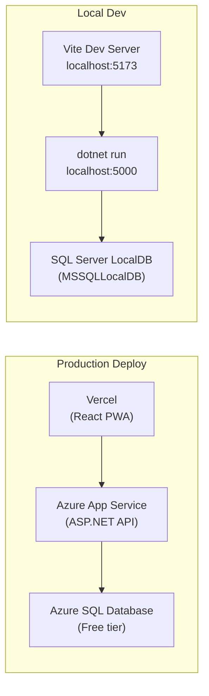

### 20.3 Local Dev Setup (không cần Docker)

SQL Server LocalDB được cài sẵn cùng Visual Studio — không cần Docker hay cài SQL Server riêng:

```powershell
# Kiểm tra LocalDB đã cài chưa
sqllocaldb info

# Tạo instance (nếu chưa có)
sqllocaldb create MSSQLLocalDB
sqllocaldb start MSSQLLocalDB

# Connection string cho LocalDB
# Server=(localdb)\MSSQLLocalDB;Database=VinhKhanhExplorer;Trusted_Connection=True;
```

### 20.4 Environment Variables

```env
# Backend (appsettings.Development.json)
# ConnectionStrings__DefaultConnection sẽ nằm trong appsettings:
# "Server=(localdb)\\MSSQLLocalDB;Database=VinhKhanhExplorer;Trusted_Connection=True;TrustServerCertificate=True;"

Jwt__SecretKey=your-256-bit-secret-key-for-jwt-signing
Jwt__Issuer=VinhKhanhExplorer
Jwt__ExpiryMinutes=60

# Frontend (.env)
VITE_API_BASE_URL=http://localhost:5000/api
VITE_GOOGLE_MAPS_API_KEY=AIzaSy...your_google_maps_api_key
```

### 20.5 Google Maps API Setup

```
1. Vào Google Cloud Console → tạo project "VinhKhanh Explorer"
2. Enable APIs:
   - Maps JavaScript API     (bản đồ)
   - Places API              (tìm kiếm địa điểm)
   - Directions API          (navigation)
   - Geocoding API           (optional)
3. Tạo API Key → Restrict:
   - Application restrictions: HTTP referrers
   - Thêm: localhost:5173/*, yourdomain.vercel.app/*
   - API restrictions: Chỉ cho phép 4 APIs trên
4. Free usage: $200 credit/month ≈ 28,000 map loads
```

---

## Các quyết định đã xác nhận ✅

| # | Quyết định | Lựa chọn |
|---|---|---|
| 1 | **Database** | SQL Server (LocalDB cho dev, Azure SQL Free cho production) |
| 2 | **Map Provider** | Google Maps API (free $200 credit/month) |
| 3 | **UI Animations** | shadcn/ui + Framer Motion (không dùng JolyUI) |
| 4 | **Deadline** | ~30/07/2026 (8 tuần từ 02/06/2026) |
| 5 | **Backend refactor** | MVC → Web API only |
| 6 | **Team size** | 2 người (Member A: Backend, Member B: Frontend) |
| 7 | **Audio strategy** | TTS hoàn toàn (Web Speech API), không thu audio |
| 8 | **Google Cloud** | Đã có account, sẵn sàng tạo API key |

> [!NOTE]
> Tất cả open questions đã được trả lời. Plan sẵn sàng để triển khai.

---

## Verification Plan

### Automated Tests
- `dotnet test` — xUnit tests cho backend services
- `npm run typecheck` — TypeScript type checking
- `npm run lint` — ESLint
- `npm run build` — Verify production build

### Manual Verification
- Field test: Đi bộ khu vực Vĩnh Khánh với app trên điện thoại
- QR scan test: In QR code, scan bằng 3+ thiết bị khác nhau
- Cross-browser: Test TTS trên Chrome, Safari, Firefox mobile
- PWA install: Test install flow trên Android Chrome + iOS Safari
