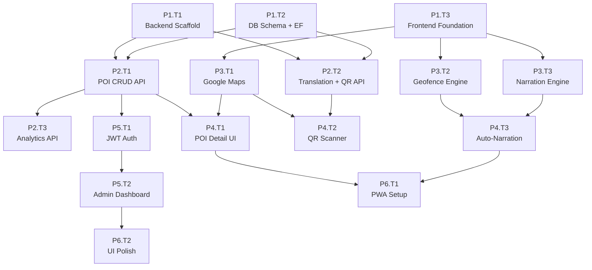

# VinhKhanh Explorer — Agent Task Breakdown

> **Mục đích**: File này chia implementation plan thành các task độc lập mà AI agent có thể đọc hiểu và thực hiện chính xác.
> **Tham chiếu**: Đọc [implementation-plan.md](./implementation-plan.md) để hiểu toàn bộ kiến trúc hệ thống.

---

## Quy ước

- **Task ID**: `P{phase}.T{task}` — Ví dụ: `P1.T1` = Phase 1, Task 1
- **Depends on**: Task phải hoàn thành trước khi bắt đầu task này
- **Owner**: `A` = Backend, `B` = Frontend, `AB` = Cả hai
- **Status**: `[ ]` chưa làm, `[/]` đang làm, `[x]` hoàn thành

---

## Dependency Graph



---

## Phase 1: Foundation (Week 1)

### `[ ]` P1.T1 — Backend API Scaffold

| Field | Value |
|---|---|
| **Owner** | A (Backend) |
| **Depends on** | None |
| **Estimated** | 4–6 hours |

#### Goal
Refactor the existing ASP.NET Core MVC project into a Web API project with Swagger, CORS, and proper service architecture.

#### Requirements

1. **Refactor `Program.cs`**:
   - Remove `AddControllersWithViews()` → use `AddControllers()`
   - Add `AddEndpointsApiExplorer()` + `AddSwaggerGen()`
   - Add CORS policy allowing `http://localhost:5173` (Vite dev server)
   - Add `UseStaticFiles()` for serving audio from wwwroot
   - Add `AddMemoryCache()`
   - Keep HTTPS redirection

2. **Add NuGet packages** to `DoAn-CSharp.csproj`:
   ```
   Microsoft.EntityFrameworkCore (9.x)
   Microsoft.EntityFrameworkCore.SqlServer (9.x)
   Microsoft.EntityFrameworkCore.Tools (9.x)
   Microsoft.AspNetCore.Authentication.JwtBearer
   Swashbuckle.AspNetCore
   QRCoder
   FluentValidation.AspNetCore
   ```

3. **Create folder structure**:
   ```
   Models/Entities/
   Models/DTOs/
   Services/
   Data/
   Middleware/
   Extensions/
   ```

4. **Create `Extensions/ServiceExtensions.cs`**:
   - Helper method to register all application services via DI
   - Example: `builder.Services.AddApplicationServices()`

5. **Create `Middleware/ExceptionMiddleware.cs`**:
   - Global exception handler returning JSON `{ error, message, statusCode }`
   - Log exceptions using `ILogger`

6. **Update `appsettings.json`** and **`appsettings.Development.json`**:
   - Add `ConnectionStrings:DefaultConnection` for SQL Server LocalDB
   - Add `Jwt:SecretKey`, `Jwt:Issuer`, `Jwt:ExpiryMinutes`

7. **Remove/deprecate MVC Views**: Remove `Views/` folder references from the project (or keep but don't route to them). Remove `HomeController.cs` or convert to a health-check API endpoint.

#### Files to Create/Modify

| Action | File |
|---|---|
| MODIFY | `Program.cs` |
| MODIFY | `DoAn-CSharp.csproj` |
| MODIFY | `appsettings.json` |
| MODIFY | `appsettings.Development.json` |
| CREATE | `Extensions/ServiceExtensions.cs` |
| CREATE | `Middleware/ExceptionMiddleware.cs` |
| CREATE | `Models/Entities/` (empty folder) |
| CREATE | `Models/DTOs/` (empty folder) |
| CREATE | `Services/` (empty folder) |
| CREATE | `Data/` (empty folder) |
| DELETE | `Views/` (optional, can keep for reference) |

#### Acceptance Criteria

- [ ] `dotnet build` succeeds with zero errors
- [ ] `dotnet run` starts the API server
- [ ] Swagger UI accessible at `https://localhost:{port}/swagger`
- [ ] CORS allows requests from `http://localhost:5173`
- [ ] Health check endpoint `GET /` returns 200
- [ ] Global exception middleware catches unhandled errors and returns JSON
- [ ] All NuGet packages installed and restorable

#### Verification

```bash
dotnet build
dotnet run
# Open browser: https://localhost:5001/swagger
# Test CORS: curl -H "Origin: http://localhost:5173" -I https://localhost:5001/
```

---

### `[ ]` P1.T2 — Database Schema + EF Core Setup

| Field | Value |
|---|---|
| **Owner** | A (Backend) |
| **Depends on** | `P1.T1` |
| **Estimated** | 4–6 hours |

#### Goal
Create all Entity Framework Core entities, DbContext, and initial migration matching the database schema from the implementation plan.

#### Requirements

1. **Create Entity classes** in `Models/Entities/`:

   **`POI.cs`**:
   ```csharp
   public class POI
   {
       public int Id { get; set; }
       public string Name { get; set; } = string.Empty;
       public string Slug { get; set; } = string.Empty;
       public double Latitude { get; set; }
       public double Longitude { get; set; }
       public int TriggerRadiusMeters { get; set; } = 30;
       public string Category { get; set; } = string.Empty; // restaurant, cafe, temple, market, park, landmark, street_art
       public int Priority { get; set; } = 5; // 1-10
       public string? ImageUrl { get; set; }
       public string? GoogleMapsUrl { get; set; }
       public bool IsActive { get; set; } = true;
       public DateTime CreatedAt { get; set; } = DateTime.UtcNow;
       public DateTime UpdatedAt { get; set; } = DateTime.UtcNow;

       // Navigation properties
       public ICollection<POITranslation> Translations { get; set; } = [];
       public ICollection<AudioFile> AudioFiles { get; set; } = [];
       public ICollection<MenuItem> MenuItems { get; set; } = [];
       public ICollection<QRCode> QRCodes { get; set; } = [];
       public ICollection<VisitLog> VisitLogs { get; set; } = [];
   }
   ```

   **`POITranslation.cs`**: Id, POIId (FK), LanguageCode, Name, ShortDescription, FullDescription, AudioText

   **`AudioFile.cs`**: Id, POIId (FK), LanguageCode, FilePath, DurationSeconds, AudioType, IsDefault

   **`MenuItem.cs`**: Id, POIId (FK), Name, Price, Currency ("VND"), ImageUrl, SortOrder
   
   **`MenuItemTranslation.cs`**: Id, MenuItemId (FK), LanguageCode, Name, Description

   **`Tour.cs`**: Id, Name, Description, EstimatedMinutes, DistanceKm, IsActive

   **`TourStop.cs`**: Id, TourId (FK), POIId (FK), StopOrder, TransitionNote

   **`QRCode.cs`**: Id, POIId (FK), Code (unique), QRImageUrl, IsActive, CreatedAt

   **`VisitLog.cs`**: Id, POIId (FK), SessionId, TriggerType ("geofence"|"qr"|"manual"), LanguageCode, VisitedAt

   **`AdminUser.cs`**: Id, Username (unique), PasswordHash, Role ("admin"|"editor"), CreatedAt

2. **Create `Data/AppDbContext.cs`**:
   - DbSet for each entity
   - Configure relationships in `OnModelCreating` using Fluent API
   - Add unique constraint on `POI.Slug`
   - Add unique constraint on `QRCode.Code`
   - Add unique constraint on `AdminUser.Username`
   - Add composite unique on `POITranslation(POIId, LanguageCode)`
   - Add composite unique on `MenuItemTranslation(MenuItemId, LanguageCode)`
   - Configure cascade delete for POI → Translations, AudioFiles, MenuItems, QRCodes
   - Index on `POI.Category`, `POI.IsActive`

3. **Register DbContext** in `Program.cs`:
   ```csharp
   builder.Services.AddDbContext<AppDbContext>(options =>
       options.UseSqlServer(builder.Configuration.GetConnectionString("DefaultConnection")));
   ```

4. **Create initial migration**:
   ```bash
   dotnet ef migrations add InitialCreate
   dotnet ef database update
   ```

5. **Create `Data/SeedData.cs`**: Static method to seed 15 POIs from Vĩnh Khánh area with:
   - Real-ish coordinates (around lat: 10.757, lng: 106.702)
   - Vietnamese names + English translations
   - Menu items for restaurant POIs (5-8 items each)
   - QR codes generated for each POI (format: `VKE-POI-{001-015}`)
   - One admin user: username `admin`, password `Admin@123`

#### Files to Create/Modify

| Action | File |
|---|---|
| CREATE | `Models/Entities/POI.cs` |
| CREATE | `Models/Entities/POITranslation.cs` |
| CREATE | `Models/Entities/AudioFile.cs` |
| CREATE | `Models/Entities/MenuItem.cs` |
| CREATE | `Models/Entities/MenuItemTranslation.cs` |
| CREATE | `Models/Entities/Tour.cs` |
| CREATE | `Models/Entities/TourStop.cs` |
| CREATE | `Models/Entities/QRCode.cs` |
| CREATE | `Models/Entities/VisitLog.cs` |
| CREATE | `Models/Entities/AdminUser.cs` |
| CREATE | `Data/AppDbContext.cs` |
| CREATE | `Data/SeedData.cs` |
| MODIFY | `Program.cs` (register DbContext + call seed) |
| MODIFY | `appsettings.Development.json` (connection string) |

#### Acceptance Criteria

- [ ] `dotnet build` succeeds
- [ ] `dotnet ef migrations add` creates migration without errors
- [ ] `dotnet ef database update` creates all tables in LocalDB
- [ ] Database has 15 POIs after seeding
- [ ] Database has English translations for all 15 POIs
- [ ] Database has menu items for restaurant POIs
- [ ] Database has QR codes for all POIs
- [ ] Database has 1 admin user
- [ ] All FK relationships work correctly (no orphan records)
- [ ] Unique constraints enforced (duplicate slug, QR code, etc.)

#### Verification

```bash
dotnet build
dotnet ef migrations add InitialCreate
dotnet ef database update
dotnet run
# Verify in SSMS or via SQL: SELECT COUNT(*) FROM POIs -- should be 15
```

---

### `[ ]` P1.T3 — Frontend Foundation

| Field | Value |
|---|---|
| **Owner** | B (Frontend) |
| **Depends on** | None |
| **Estimated** | 4–6 hours |

#### Goal
Set up the React frontend with routing, layout shell, state management, API client, and all required packages.

#### Requirements

1. **Install npm packages** in `VinhKhanh-Explorer/`:
   ```bash
   npm install react-router-dom @tanstack/react-query @vis.gl/react-google-maps zustand qr-scanner framer-motion recharts
   npm install -D vite-plugin-pwa
   ```

2. **Set up React Router** in `App.tsx`:
   ```
   /              → ExplorePage (map + narration)
   /discover      → DiscoverPage (POI list)
   /poi/:id       → POIDetailPage
   /scan          → ScanPage (QR scanner)
   /settings      → SettingsPage
   /qr/:code      → Redirect to POI + auto-play
   /admin         → DashboardPage (protected)
   /admin/pois    → POIEditorPage (protected)
   /admin/tours   → ToursPage (protected)
   /admin/analytics → AnalyticsPage (protected)
   ```

3. **Create layout components**:
   - `components/layout/MobileLayout.tsx`: Header (app name + language selector) + `<Outlet/>` + Bottom nav
   - `components/layout/BottomNav.tsx`: 4 tabs — Explore (🗺️), Discover (🔍), Scan (📸), Settings (⚙️)
   - `components/layout/AdminLayout.tsx`: Sidebar nav + `<Outlet/>`

4. **Create page stubs** (empty components with title):
   - `pages/ExplorePage.tsx`
   - `pages/DiscoverPage.tsx`
   - `pages/POIDetailPage.tsx`
   - `pages/ScanPage.tsx`
   - `pages/SettingsPage.tsx`
   - `pages/admin/DashboardPage.tsx`
   - `pages/admin/POIEditorPage.tsx`
   - `pages/admin/ToursPage.tsx`
   - `pages/admin/AnalyticsPage.tsx`

5. **Create API client** `services/api.ts`:
   - Base URL from `import.meta.env.VITE_API_BASE_URL`
   - Wrapper functions: `get<T>()`, `post<T>()`, `put<T>()`, `del<T>()`
   - Auto-attach JWT token from `authStore` for admin requests
   - Error handling with typed error responses

6. **Create Zustand stores**:
   - `stores/settingsStore.ts`: `language` (default "en"), `audioEnabled` (default true), `darkMode`
   - `stores/locationStore.ts`: `position` (lat, lng, accuracy), `isTracking`, `lastUpdated`
   - `stores/narrationStore.ts`: `isPlaying`, `currentPOI`, `queue`, `cooldownMap`
   - `stores/authStore.ts`: `token`, `isAuthenticated`, `login()`, `logout()`

7. **Set up TanStack Query** provider in `main.tsx`

8. **Create `.env` file** in `VinhKhanh-Explorer/`:
   ```
   VITE_API_BASE_URL=http://localhost:5000/api
   VITE_GOOGLE_MAPS_API_KEY=
   ```

9. **Create TypeScript types** in `types/`:
   - `types/poi.ts`: POI, POITranslation, MenuItem, MenuItemTranslation interfaces
   - `types/audio.ts`: NarrationItem, AudioQueueConfig, NarrationState
   - `types/api.ts`: ApiResponse<T>, ApiError, PaginatedResponse<T>

#### Files to Create/Modify

| Action | File |
|---|---|
| MODIFY | `App.tsx` (add routing) |
| MODIFY | `main.tsx` (add QueryClientProvider) |
| CREATE | `components/layout/MobileLayout.tsx` |
| CREATE | `components/layout/BottomNav.tsx` |
| CREATE | `components/layout/AdminLayout.tsx` |
| CREATE | `pages/ExplorePage.tsx` (stub) |
| CREATE | `pages/DiscoverPage.tsx` (stub) |
| CREATE | `pages/POIDetailPage.tsx` (stub) |
| CREATE | `pages/ScanPage.tsx` (stub) |
| CREATE | `pages/SettingsPage.tsx` (stub) |
| CREATE | `pages/admin/DashboardPage.tsx` (stub) |
| CREATE | `pages/admin/POIEditorPage.tsx` (stub) |
| CREATE | `pages/admin/ToursPage.tsx` (stub) |
| CREATE | `pages/admin/AnalyticsPage.tsx` (stub) |
| CREATE | `services/api.ts` |
| CREATE | `stores/settingsStore.ts` |
| CREATE | `stores/locationStore.ts` |
| CREATE | `stores/narrationStore.ts` |
| CREATE | `stores/authStore.ts` |
| CREATE | `types/poi.ts` |
| CREATE | `types/audio.ts` |
| CREATE | `types/api.ts` |
| CREATE | `.env` |

#### Acceptance Criteria

- [ ] `npm run dev` starts without errors
- [ ] `npm run typecheck` passes
- [ ] All routes render their stub pages
- [ ] Bottom navigation switches between pages
- [ ] Mobile layout has header + content area + bottom nav
- [ ] Admin routes use AdminLayout with sidebar
- [ ] API client is importable and typed
- [ ] Stores are functional (can set/get values)
- [ ] `.env` variables are accessible in code

#### Verification

```bash
cd VinhKhanh-Explorer
npm install
npm run dev
npm run typecheck
npm run lint
# Manual: navigate to each route, verify page renders
```

---

## Phase 2: Core Backend APIs (Week 2)

### `[ ]` P2.T1 — POI CRUD API + Seed Data

| Field | Value |
|---|---|
| **Owner** | A (Backend) |
| **Depends on** | `P1.T1`, `P1.T2` |
| **Estimated** | 6–8 hours |

#### Goal
Implement full CRUD API for Points of Interest with filtering, spatial proximity queries, and populate database with 15 real POIs.

#### Requirements

1. **Create DTOs** in `Models/DTOs/`:
   - `POIDto.cs`: Response DTO with translation for requested language
   - `POIListDto.cs`: Slim DTO for list views (id, name, slug, lat, lng, category, imageUrl, distance?)
   - `POICreateDto.cs`: Create request (name, lat, lng, triggerRadius, category, priority, imageUrl, googleMapsUrl)
   - `POIUpdateDto.cs`: Update request (same fields, all optional)
   - `POINearbyQueryDto.cs`: Query params (lat, lng, radiusMeters, lang)

2. **Create `Services/IPOIService.cs` + `Services/POIService.cs`**:
   - `GetAllAsync(string? category, string lang)`: List active POIs with translation
   - `GetByIdAsync(int id, string lang)`: Single POI with full translation + menu count
   - `GetNearbyAsync(double lat, double lng, int radiusMeters, string lang)`: POIs within radius, sorted by distance (use Haversine formula in LINQ)
   - `CreateAsync(POICreateDto dto)`: Create POI + auto-generate slug
   - `UpdateAsync(int id, POIUpdateDto dto)`: Update POI
   - `DeleteAsync(int id)`: Soft delete (set IsActive = false)

3. **Haversine distance calculation** in SQL/LINQ:
   ```csharp
   // Calculate distance in meters between two coordinates
   // Use Math functions in LINQ that translate to SQL
   var earthRadius = 6371000.0;
   // ... Haversine formula in Where + OrderBy
   ```

4. **Create `Controllers/POIController.cs`**:
   ```
   [Route("api/pois")]
   GET  /api/pois?category={cat}&lang={lang}     → GetAll
   GET  /api/pois/{id}?lang={lang}               → GetById
   GET  /api/pois/nearby?lat=X&lng=Y&r=500&lang=en → GetNearby
   POST /api/admin/pois                          → Create [Authorize]
   PUT  /api/admin/pois/{id}                     → Update [Authorize]
   DELETE /api/admin/pois/{id}                   → Delete [Authorize]
   ```

5. **Validate inputs** using FluentValidation:
   - Latitude: -90 to 90
   - Longitude: -180 to 180
   - TriggerRadiusMeters: 5 to 500
   - Priority: 1 to 10
   - Category: must be one of allowed values

6. **Populate seed data**: 15 POIs with real Vĩnh Khánh coordinates. Each POI must have:
   - Vietnamese name (original)
   - English translation (name, shortDescription, fullDescription, audioText)
   - Category assigned
   - Priority 1-10
   - TriggerRadiusMeters (20-50 based on size)
   - GoogleMapsUrl (can use placeholder format)

#### Files to Create/Modify

| Action | File |
|---|---|
| CREATE | `Models/DTOs/POIDto.cs` |
| CREATE | `Models/DTOs/POIListDto.cs` |
| CREATE | `Models/DTOs/POICreateDto.cs` |
| CREATE | `Models/DTOs/POIUpdateDto.cs` |
| CREATE | `Services/IPOIService.cs` |
| CREATE | `Services/POIService.cs` |
| CREATE | `Controllers/POIController.cs` |
| CREATE | `Validators/POICreateValidator.cs` |
| MODIFY | `Data/SeedData.cs` (add 15 POIs) |
| MODIFY | `Extensions/ServiceExtensions.cs` (register POIService) |

#### Acceptance Criteria

- [ ] `GET /api/pois` returns 15 POIs
- [ ] `GET /api/pois?category=restaurant` filters correctly
- [ ] `GET /api/pois/1?lang=en` returns POI with English translation
- [ ] `GET /api/pois/nearby?lat=10.757&lng=106.702&r=1000` returns POIs sorted by distance
- [ ] `POST /api/admin/pois` creates a new POI (returns 401 without auth)
- [ ] Validation rejects invalid coordinates
- [ ] `dotnet test` passes for POI service tests
- [ ] Swagger shows all endpoints with correct schemas

---

### `[ ]` P2.T2 — Translation API + QR Code API

| Field | Value |
|---|---|
| **Owner** | A (Backend) |
| **Depends on** | `P1.T1`, `P1.T2` |
| **Estimated** | 4–6 hours |

#### Goal
Implement translation CRUD and QR code generation/lookup APIs.

#### Requirements

1. **Translation Service + Controller**:
   - `GET /api/translations/{poiId}/{lang}` → Get translation for POI
   - `POST /api/admin/translations` → Create/upsert translation `[Authorize]`
   - `DELETE /api/admin/translations/{id}` → Delete `[Authorize]`
   - DTOs: `TranslationDto`, `TranslationCreateDto`

2. **QR Code Service + Controller**:
   - `GET /api/qr/{code}` → Lookup POI by QR code (public, returns POI detail + translation)
   - `POST /api/admin/qr/generate/{poiId}` → Generate QR code image using `QRCoder` library `[Authorize]`
   - QR code format: `VKE-POI-{id:D3}` (e.g., `VKE-POI-001`)
   - Save generated QR image to `wwwroot/qrcodes/`
   - DTOs: `QRCodeDto`, `QRLookupResponseDto`

3. **Menu Service + Controller**:
   - `GET /api/pois/{poiId}/menu?lang={lang}` → Get menu items with translations
   - `POST /api/admin/pois/{poiId}/menu` → Add menu item `[Authorize]`
   - `PUT /api/admin/menu/{id}` → Update menu item `[Authorize]`
   - `DELETE /api/admin/menu/{id}` → Delete menu item `[Authorize]`
   - DTOs: `MenuItemDto`, `MenuItemCreateDto`

#### Files to Create/Modify

| Action | File |
|---|---|
| CREATE | `Services/ITranslationService.cs` + `TranslationService.cs` |
| CREATE | `Services/IQRCodeService.cs` + `QRCodeService.cs` |
| CREATE | `Services/IMenuService.cs` + `MenuService.cs` |
| CREATE | `Controllers/TranslationController.cs` |
| CREATE | `Controllers/QRController.cs` |
| CREATE | `Controllers/MenuController.cs` |
| CREATE | `Models/DTOs/TranslationDto.cs` |
| CREATE | `Models/DTOs/QRCodeDto.cs` |
| CREATE | `Models/DTOs/MenuItemDto.cs` |
| CREATE | `wwwroot/qrcodes/` (folder) |

#### Acceptance Criteria

- [ ] `GET /api/translations/1/en` returns English translation
- [ ] `GET /api/qr/VKE-POI-001` returns POI data
- [ ] `POST /api/admin/qr/generate/1` generates QR image file
- [ ] `GET /api/pois/1/menu?lang=en` returns menu items with translations
- [ ] QR code image file exists in `wwwroot/qrcodes/`
- [ ] Invalid QR code returns 404
- [ ] `dotnet test` passes

---

### `[ ]` P2.T3 — Analytics API

| Field | Value |
|---|---|
| **Owner** | A (Backend) |
| **Depends on** | `P2.T1` |
| **Estimated** | 2–3 hours |

#### Goal
Implement visit logging and basic analytics summary endpoint.

#### Requirements

1. **Analytics Service + Controller**:
   - `POST /api/analytics/visit` → Log visit (public, fire-and-forget)
     - Body: `{ poiId, sessionId, triggerType, languageCode }`
     - No auth required (tourist doesn't log in)
   - `GET /api/admin/analytics/summary` → Dashboard stats `[Authorize]`
     - Total visits, visits per POI, visits per day (last 30 days), popular POIs
   - `GET /api/admin/analytics/visits?poiId=X&from=X&to=X` → Visit log with filters `[Authorize]`

2. **DTOs**: `VisitCreateDto`, `AnalyticsSummaryDto`, `VisitLogDto`

#### Files to Create/Modify

| Action | File |
|---|---|
| CREATE | `Services/IAnalyticsService.cs` + `AnalyticsService.cs` |
| CREATE | `Controllers/AnalyticsController.cs` |
| CREATE | `Models/DTOs/AnalyticsDto.cs` |

#### Acceptance Criteria

- [ ] `POST /api/analytics/visit` returns 201 (no auth needed)
- [ ] `GET /api/admin/analytics/summary` returns stats
- [ ] Visit count increments correctly
- [ ] `dotnet test` passes

---

## Phase 3: Core Frontend (Week 3)

### `[ ]` P3.T1 — Google Maps Integration

| Field | Value |
|---|---|
| **Owner** | B (Frontend) |
| **Depends on** | `P1.T3` |
| **Estimated** | 6–8 hours |

#### Goal
Implement interactive Google Maps view with POI markers, user location, and nearest POI highlighting.

#### Requirements

1. **Map component** `components/map/MapView.tsx`:
   - Full-screen Google Map using `@vis.gl/react-google-maps`
   - Center on Vĩnh Khánh area (default: 10.757, 106.702)
   - Dark/light map style based on theme
   - Google Maps API key from `VITE_GOOGLE_MAPS_API_KEY`

2. **User location** `components/map/UserLocation.tsx`:
   - Blue pulsing dot for user position
   - Accuracy circle
   - "Center on me" button

3. **POI markers** `components/map/POIMarker.tsx`:
   - Category-colored markers (restaurant=orange, cafe=brown, temple=red, etc.)
   - Active/nearest marker pulsing animation
   - Click → open POI bottom sheet
   - Cluster markers when zoomed out (optional)

4. **Use `useGeolocation` hook** `hooks/useGeolocation.ts`:
   - Wrap `navigator.geolocation.watchPosition()`
   - Update `locationStore` with position
   - Handle permission denied gracefully
   - Filter low-accuracy readings (>50m)

5. **Fetch POIs** from backend:
   - Use TanStack Query: `useQuery(['pois'], () => api.get('/pois?lang=' + lang))`
   - Cache POI data (stale time: 5 min)

6. **Integrate into `ExplorePage.tsx`**:
   - Full-screen map
   - Floating POI count badge
   - Nearest POI indicator card at bottom

#### Files to Create/Modify

| Action | File |
|---|---|
| CREATE | `components/map/MapView.tsx` |
| CREATE | `components/map/POIMarker.tsx` |
| CREATE | `components/map/UserLocation.tsx` |
| CREATE | `hooks/useGeolocation.ts` |
| CREATE | `services/poiService.ts` |
| CREATE | `hooks/usePOI.ts` |
| MODIFY | `pages/ExplorePage.tsx` |

#### Acceptance Criteria

- [ ] Google Maps renders in ExplorePage
- [ ] POI markers displayed for all 15 POIs
- [ ] Markers have different colors by category
- [ ] User location dot appears (with permission)
- [ ] Clicking a marker shows POI info
- [ ] Map style switches with dark mode
- [ ] `npm run typecheck` passes

---

### `[ ]` P3.T2 — Geofence Engine

| Field | Value |
|---|---|
| **Owner** | B (Frontend) |
| **Depends on** | `P1.T3`, `P3.T1` |
| **Estimated** | 4–6 hours |

#### Goal
Implement client-side geofence detection that triggers events when user enters a POI's radius.

#### Requirements

1. **Pure logic module** `lib/geofence.ts`:
   - `haversineDistance(lat1, lng1, lat2, lng2): number` — returns meters
   - `findTriggeredPOIs(position, pois, cooldownMap): GeofenceEvent[]`
   - `GeofenceConfig` interface with:
     - `minAccuracyMeters: 50`
     - `cooldownMinutes: 30`
     - `debounceMs: 2000`
     - `maxSimultaneousTriggers: 1`

2. **React hook** `hooks/useGeofence.ts`:
   - Takes: POI list, user position (from locationStore)
   - Returns: `{ triggeredPOI, nearestPOI, isInRange }`
   - Manages cooldown Map (POI ID → last trigger timestamp)
   - Debounce: only trigger if user in range for 2+ consecutive readings
   - Persist cooldown map in sessionStorage

3. **Cooldown logic**:
   - After triggering a POI, don't re-trigger for 30 minutes
   - Cooldown is per-POI, not global
   - Reset on app restart (sessionStorage)

4. **Priority handling**:
   - If multiple POIs in range, trigger highest priority first
   - If same priority, trigger nearest

#### Files to Create/Modify

| Action | File |
|---|---|
| CREATE | `lib/geofence.ts` |
| CREATE | `hooks/useGeofence.ts` |
| CREATE | `lib/constants.ts` (geofence config) |

#### Acceptance Criteria

- [ ] `haversineDistance()` returns correct distance (test with known coordinates)
- [ ] Geofence triggers when user position is within POI radius
- [ ] Geofence does NOT re-trigger within 30-minute cooldown
- [ ] Debounce works: no trigger on single brief reading
- [ ] Priority sorting works correctly
- [ ] `npm run typecheck` passes

---

### `[ ]` P3.T3 — Narration Engine (TTS + Audio Queue)

| Field | Value |
|---|---|
| **Owner** | B (Frontend) |
| **Depends on** | `P1.T3` |
| **Estimated** | 4–6 hours |

#### Goal
Implement Text-to-Speech narration system with queue management, playback controls, and UI player.

#### Requirements

1. **Audio queue logic** `lib/audioQueue.ts`:
   - `NarrationItem`: `{ poiId, text, language, priority }`
   - `AudioQueueManager` class:
     - `enqueue(item)`: Add to queue (max 3)
     - `dequeue()`: Get next item
     - `interrupt(item)`: Stop current, play this (higher priority)
     - `clear()`: Stop all
   - Queue config: `maxSize: 3`, `gapBetweenItemsMs: 1000`

2. **TTS wrapper** `lib/tts.ts`:
   - `speak(text, lang): Promise<void>` — wraps Web Speech API
   - `stop()`: Cancel current speech
   - `getAvailableVoices(lang): SpeechSynthesisVoice[]`
   - `selectBestVoice(lang)`: Pick highest quality voice for language
   - Rate: 0.9, Pitch: 1.0

3. **React hook** `hooks/useNarration.ts`:
   - Combines queue manager + TTS
   - Exposes: `{ isPlaying, currentItem, play(item), pause(), resume(), skip(), stop() }`
   - Updates `narrationStore` with current state
   - Handles queue progression (auto-play next after gap)

4. **Player UI** `components/narration/NarrationPlayer.tsx`:
   - Fixed bottom bar (above bottom nav)
   - Shows: POI name, play/pause button, skip button
   - Progress indicator (TTS doesn't have duration, show animated waveform)
   - Slide-up animation when playing, slide-down when idle
   - Framer Motion for transitions

#### Files to Create/Modify

| Action | File |
|---|---|
| CREATE | `lib/audioQueue.ts` |
| CREATE | `lib/tts.ts` |
| CREATE | `hooks/useNarration.ts` |
| CREATE | `components/narration/NarrationPlayer.tsx` |
| MODIFY | `stores/narrationStore.ts` |
| MODIFY | `components/layout/MobileLayout.tsx` (add player) |

#### Acceptance Criteria

- [ ] TTS speaks text in English
- [ ] TTS speaks text in other supported languages (if voices available)
- [ ] Queue accepts up to 3 items
- [ ] Higher priority item interrupts current playback
- [ ] Pause/resume works
- [ ] Skip advances to next item
- [ ] Player UI appears when narration is active
- [ ] Player hides when nothing is playing
- [ ] `npm run typecheck` passes

---

## Phase 4: Integration (Week 4)

### `[ ]` P4.T1 — POI Detail UI + Menu Viewer

| Field | Value |
|---|---|
| **Owner** | B (Frontend) |
| **Depends on** | `P2.T1`, `P3.T1` |
| **Estimated** | 6–8 hours |

#### Goal
Build the POI detail bottom sheet and menu translation viewer.

#### Requirements

1. **POI Bottom Sheet** `components/poi/POISheet.tsx`:
   - Slide-up bottom sheet (70% screen height) using Framer Motion
   - Cover image at top
   - POI name (bilingual: Vietnamese + translated)
   - Category badge
   - Distance from user
   - Short description
   - "Listen" button → trigger narration
   - "View Menu" button (for restaurants)
   - "Navigate" button → open Google Maps link
   - Close button / swipe down to close

2. **Menu Viewer** `components/poi/MenuViewer.tsx`:
   - Grid of menu item cards
   - Each card: image, Vietnamese name, translated name, price
   - "Read aloud" button per item → TTS reads translated name + description
   - Language selector within menu view

3. **POI Card** `components/poi/POICard.tsx`:
   - Compact card for list views
   - Image, name, category icon, distance

4. **POI List** `components/poi/POIList.tsx`:
   - Scrollable list of POICards
   - Sort by: distance, name, category

5. **Implement `DiscoverPage.tsx`**:
   - List of all POIs with search/filter
   - Category filter tabs
   - Click → open POISheet

6. **Implement `POIDetailPage.tsx`**:
   - Full page POI detail (for direct URL access / QR redirect)
   - Same content as POISheet but full page

#### Files to Create/Modify

| Action | File |
|---|---|
| CREATE | `components/poi/POISheet.tsx` |
| CREATE | `components/poi/MenuViewer.tsx` |
| CREATE | `components/poi/POICard.tsx` |
| CREATE | `components/poi/POIList.tsx` |
| MODIFY | `pages/DiscoverPage.tsx` |
| MODIFY | `pages/POIDetailPage.tsx` |
| MODIFY | `pages/ExplorePage.tsx` (connect sheet to markers) |

#### Acceptance Criteria

- [ ] Clicking a map marker opens POI bottom sheet
- [ ] Sheet shows bilingual name, description, image
- [ ] "Listen" button triggers TTS narration
- [ ] Menu viewer shows items with translations
- [ ] DiscoverPage lists all POIs with category filter
- [ ] Direct URL `/poi/1` renders full detail page
- [ ] Animations are smooth (60fps)

---

### `[ ]` P4.T2 — QR Scanner + Trigger

| Field | Value |
|---|---|
| **Owner** | B (Frontend) |
| **Depends on** | `P2.T2`, `P3.T1` |
| **Estimated** | 3–4 hours |

#### Goal
Implement QR code scanning that looks up POI and auto-triggers narration.

#### Requirements

1. **QR Scanner** `components/qr/QRScanner.tsx`:
   - Full-screen camera overlay
   - Scan frame animation (corners animating)
   - Use `qr-scanner` library
   - On detect: parse QR code → call API → open POI sheet + auto-narrate
   - Fallback: text input field for manual QR code entry

2. **Implement `ScanPage.tsx`**:
   - Camera permission request
   - QR scanner component
   - Recent scans history (store in localStorage)

3. **QR route handler**:
   - `/qr/:code` → Fetch POI by code → redirect to POI detail + auto-play

4. **QR Service** `services/qrService.ts`:
   - `lookupQR(code: string): Promise<POIDto>`

#### Files to Create/Modify

| Action | File |
|---|---|
| CREATE | `components/qr/QRScanner.tsx` |
| CREATE | `services/qrService.ts` |
| MODIFY | `pages/ScanPage.tsx` |
| MODIFY | `App.tsx` (add QR redirect route) |

#### Acceptance Criteria

- [ ] Camera opens with permission prompt
- [ ] QR code scanned → POI loads → narration starts
- [ ] Manual input works as fallback
- [ ] Invalid QR shows error message
- [ ] `/qr/VKE-POI-001` redirects to correct POI

---

### `[ ]` P4.T3 — Auto-Narration Integration

| Field | Value |
|---|---|
| **Owner** | AB (Both) |
| **Depends on** | `P3.T2`, `P3.T3` |
| **Estimated** | 3–4 hours |

#### Goal
Wire up geofence engine + narration engine so audio auto-plays when user walks near a POI.

#### Requirements

1. **Integration in `ExplorePage.tsx`**:
   - `useGeofence` hook watches position vs POI list
   - When `triggeredPOI` fires → `useNarration.play()` with POI's audioText
   - Show toast notification: "Now playing: {POI name}"
   - Log visit via `POST /api/analytics/visit`
   - Update map to highlight triggered POI marker

2. **Settings integration**:
   - Respect `audioEnabled` setting from settingsStore
   - Respect selected `language` for TTS
   - If audio disabled, still show visual notification but don't play

3. **Implement `SettingsPage.tsx`**:
   - Language selector (EN, JA, KO, ZH)
   - Audio toggle on/off
   - Auto-narration toggle on/off
   - Trigger radius multiplier (0.5x, 1x, 2x) — for demo flexibility
   - Dark mode toggle
   - About section

#### Files to Create/Modify

| Action | File |
|---|---|
| MODIFY | `pages/ExplorePage.tsx` (wire geofence + narration) |
| MODIFY | `pages/SettingsPage.tsx` |
| CREATE | `services/analyticsService.ts` |

#### Acceptance Criteria

- [ ] Walking near a POI (simulated via Chrome DevTools Sensors) triggers narration
- [ ] Narration speaks in selected language
- [ ] Cooldown prevents re-trigger within 30 min
- [ ] Disabling audio in settings stops narration
- [ ] Visit logged to backend
- [ ] Triggered marker pulses on map

---

## Phase 5: Admin System (Week 5)

### `[ ]` P5.T1 — JWT Authentication

| Field | Value |
|---|---|
| **Owner** | A (Backend) |
| **Depends on** | `P2.T1` |
| **Estimated** | 4–5 hours |

#### Goal
Implement JWT-based admin authentication for the backend.

#### Requirements

1. **Auth Service** `Services/AuthService.cs`:
   - `LoginAsync(username, password)`: Validate credentials, return JWT token
   - `GenerateToken(AdminUser)`: Create JWT with claims (userId, username, role)
   - Password hashing: use `BCrypt.Net` or `Microsoft.AspNetCore.Identity.PasswordHasher`

2. **Auth Controller** `Controllers/AuthController.cs`:
   - `POST /api/auth/login` → `{ username, password }` → `{ token, expiresAt }`

3. **Configure JWT** in `Program.cs`:
   - Read secret from `appsettings.json`
   - Token expiry: 60 minutes
   - Validate issuer, audience, lifetime

4. **Protect admin endpoints**: All `/api/admin/*` routes require `[Authorize]`

5. **Add `BCrypt.Net-Next`** NuGet package

#### Files to Create/Modify

| Action | File |
|---|---|
| CREATE | `Services/IAuthService.cs` + `AuthService.cs` |
| CREATE | `Controllers/AuthController.cs` |
| CREATE | `Models/DTOs/AuthDto.cs` (LoginRequest, LoginResponse) |
| MODIFY | `Program.cs` (JWT configuration) |
| MODIFY | `DoAn-CSharp.csproj` (add BCrypt) |

#### Acceptance Criteria

- [ ] `POST /api/auth/login` with correct credentials returns JWT
- [ ] `POST /api/auth/login` with wrong password returns 401
- [ ] Admin endpoints return 401 without token
- [ ] Admin endpoints return 200 with valid token
- [ ] Token expires after 60 minutes

---

### `[ ]` P5.T2 — Admin Dashboard UI

| Field | Value |
|---|---|
| **Owner** | B (Frontend) |
| **Depends on** | `P5.T1`, `P4.T1` |
| **Estimated** | 8–10 hours |

#### Goal
Build the admin CMS interface for managing POIs, translations, and viewing basic analytics.

#### Requirements

1. **Admin Login Page** (at `/admin`):
   - Username + password form
   - Store JWT in `authStore`
   - Redirect to dashboard on success

2. **Admin Layout**:
   - Sidebar: Dashboard, POIs, Tours (stub), Analytics (basic)
   - Top bar: admin name, logout button

3. **POI Manager** `components/admin/POIManager.tsx`:
   - Data table showing all POIs (id, name, category, active, actions)
   - "Add POI" button → form dialog
   - Edit button → form dialog pre-filled
   - Delete button → confirmation dialog
   - Form fields: name, lat, lng, category (dropdown), priority (slider), triggerRadius, imageUrl, googleMapsUrl

4. **Translation Editor** `components/admin/TranslationEditor.tsx`:
   - Select POI → show translations per language
   - Add/edit translation: name, shortDescription, fullDescription, audioText
   - Preview TTS button

5. **Basic Analytics** `components/admin/AnalyticsDashboard.tsx`:
   - Total visits counter
   - Visits per day chart (recharts BarChart, last 30 days)
   - Top 10 most visited POIs (recharts PieChart)

6. **Add required shadcn/ui components**:
   - Table, Dialog, Input, Select, Textarea, Slider, Tabs
   - Install via `npx shadcn@latest add table dialog input select textarea slider tabs`

#### Files to Create/Modify

| Action | File |
|---|---|
| CREATE | `components/admin/POIManager.tsx` |
| CREATE | `components/admin/TranslationEditor.tsx` |
| CREATE | `components/admin/AnalyticsDashboard.tsx` |
| MODIFY | `pages/admin/DashboardPage.tsx` |
| MODIFY | `pages/admin/POIEditorPage.tsx` |
| MODIFY | `pages/admin/AnalyticsPage.tsx` |
| MODIFY | `components/layout/AdminLayout.tsx` |
| CREATE | various `components/ui/` via shadcn CLI |

#### Acceptance Criteria

- [ ] Admin can login with username/password
- [ ] Admin can see POI data table
- [ ] Admin can create a new POI (appears on map immediately)
- [ ] Admin can edit existing POI
- [ ] Admin can add translations for POIs
- [ ] Analytics shows visit charts
- [ ] Unauthorized access redirects to login

---

## Phase 6: Polish (Week 6)

### `[ ]` P6.T1 — PWA Setup

| Field | Value |
|---|---|
| **Owner** | B (Frontend) |
| **Depends on** | `P4.T1`, `P4.T3` |
| **Estimated** | 3–4 hours |

#### Goal
Configure PWA with service worker, manifest, and install prompt.

#### Requirements

1. **Configure `vite-plugin-pwa`** in `vite.config.ts`:
   - Manifest: name, icons, theme_color, background_color, display: standalone
   - Service worker with runtime caching strategies:
     - `/api/pois` → StaleWhileRevalidate
     - `/audio/` → CacheFirst
     - App shell → Precache

2. **Create PWA icons**: 192x192 and 512x512 (can generate from text/placeholder)

3. **Install prompt component**: Show "Add to Home Screen" banner on first visit

4. **Test**: Build production, serve with `npm run preview`, verify PWA installable

#### Files to Create/Modify

| Action | File |
|---|---|
| MODIFY | `vite.config.ts` |
| CREATE | `public/icon-192.png` |
| CREATE | `public/icon-512.png` |
| CREATE | `components/pwa/InstallPrompt.tsx` |

#### Acceptance Criteria

- [ ] `npm run build` produces valid PWA
- [ ] Chrome shows install prompt
- [ ] App works from home screen (standalone mode)
- [ ] POI data cached offline

---

### `[ ]` P6.T2 — UI Polish + Animations

| Field | Value |
|---|---|
| **Owner** | B (Frontend) |
| **Depends on** | `P5.T2` |
| **Estimated** | 4–6 hours |

#### Goal
Add premium Framer Motion animations, glassmorphism effects, and final design polish.

#### Requirements

1. **Page transitions**: Fade/slide between routes
2. **Bottom sheet**: Spring-based slide-up animation
3. **POI markers**: Pulse animation for active/nearest
4. **Narration player**: Slide-up on play, animated waveform bars
5. **QR scanner**: Corner scan-line animation
6. **Loading states**: Skeleton loaders for POI cards/list
7. **Glassmorphism**: Apply to overlays on map (`backdrop-blur-xl bg-white/10 dark:bg-black/20`)
8. **Micro-interactions**: Button hover/press effects, toggle animations
9. **Toast notifications**: Slide-in notifications for narration triggers
10. **Error states**: Friendly error pages with retry buttons

#### Files to Modify

| Action | File |
|---|---|
| MODIFY | Multiple component files (add motion animations) |
| CREATE | `components/ui/Skeleton.tsx` (if not from shadcn) |
| CREATE | `components/ui/Toast.tsx` (or use shadcn toast) |

#### Acceptance Criteria

- [ ] All page transitions are smooth (no jump-cuts)
- [ ] Bottom sheet animates naturally
- [ ] Map overlays use glassmorphism
- [ ] Loading states use skeleton loaders
- [ ] Overall feel is "premium travel app" quality
- [ ] No visual jank or layout shifts

---

## Phase 7: Testing (Week 7)

### `[ ]` P7.T1 — Backend Integration Tests

| Field | Value |
|---|---|
| **Owner** | A (Backend) |
| **Depends on** | All Phase 2 + Phase 5 tasks |
| **Estimated** | 6–8 hours |

#### Goal
Write xUnit integration tests for all API endpoints.

#### Requirements

1. Test categories:
   - POI CRUD operations
   - Translation CRUD
   - QR code lookup
   - Menu items
   - Analytics logging
   - Auth (login, protected routes)
   - Spatial query (nearby POIs)

2. Use `WebApplicationFactory<Program>` for integration tests
3. Use in-memory database or test LocalDB instance
4. Target: 80%+ code coverage for Services layer

#### Acceptance Criteria

- [ ] `dotnet test` passes all tests (green)
- [ ] Coverage report shows 80%+ for Services/

---

### `[ ]` P7.T2 — Frontend Testing + Field Test Prep

| Field | Value |
|---|---|
| **Owner** | B (Frontend) |
| **Depends on** | All Phase 3 + Phase 4 tasks |
| **Estimated** | 4–6 hours |

#### Goal
Verify frontend functionality, prepare GPS simulation presets for demo.

#### Requirements

1. `npm run typecheck` — zero errors
2. `npm run lint` — zero warnings
3. `npm run build` — successful production build
4. Create GPS simulation presets (Chrome DevTools Sensors coordinates) for 5 POIs
5. Document demo walkthrough steps
6. Test on mobile Chrome + Safari (real device if possible)

#### Acceptance Criteria

- [ ] All type checks pass
- [ ] Production build succeeds
- [ ] GPS simulation triggers narration correctly
- [ ] QR scan works on mobile
- [ ] PWA installs on mobile

---

## Phase 8: Demo Prep (Week 8)

### `[ ]` P8.T1 — Deploy + Demo Script

| Field | Value |
|---|---|
| **Owner** | AB (Both) |
| **Depends on** | All previous phases |
| **Estimated** | 8–10 hours |

#### Goal
Deploy to production and prepare demo presentation.

#### Requirements

1. **Deploy Backend**: Azure App Service (free tier) or Railway
2. **Deploy Frontend**: Vercel (connect to git repo)
3. **Deploy Database**: Azure SQL Free tier
4. **Configure production env vars**
5. **Print 5 QR codes** for demo
6. **Prepare demo script** (10-15 minutes):
   - Problem introduction
   - PWA install demo
   - Map + auto-narration demo (GPS simulation)
   - QR scan demo (printed QR codes)
   - Menu translation demo
   - Admin CMS demo
   - Architecture overview slide
7. **Record backup video** of full demo flow

#### Acceptance Criteria

- [ ] App accessible via public URL
- [ ] All features work on production
- [ ] 5 printed QR codes ready
- [ ] Demo script rehearsed
- [ ] Backup video recorded

---

## Quick Reference: Parallel Execution

Agents can work on tasks simultaneously when there are no dependencies:

| Phase | Can run in parallel |
|---|---|
| **Phase 1** | P1.T1 + P1.T3 (backend + frontend, no dependency) |
| **Phase 2** | P2.T1 + P2.T2 (both depend on P1.T1+T2, but are independent of each other) |
| **Phase 3** | P3.T1 + P3.T2 + P3.T3 (all depend on P1.T3, but independent of each other) |
| **Phase 4** | P4.T1 + P4.T2 (independent, but P4.T3 depends on both P3.T2 and P3.T3) |
| **Phase 5** | P5.T1 first, then P5.T2 (sequential) |
| **Phase 6** | P6.T1 + P6.T2 (independent) |
| **Phase 7** | P7.T1 + P7.T2 (backend + frontend tests, independent) |
